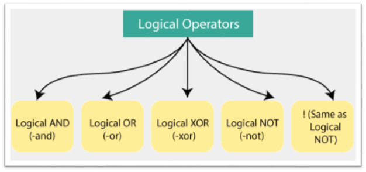

title: Powershell Cheatsheet
repo: PyroCheat (https://github.com/emilefraser/PyroCheat)
author: emilefraser
created: 2021-12-31 (emilefraser)
updated: 2021-12-31 (emilefraser)

[TOC]


# Powershell Cheatsheet

## Punctuation

| Symbol | Name | Description |
| --- | --- | --- |
| Enter | Carriage Return | EOL |
| ; | EOS | If use multiple statements on line |
| \$ | Var Prefix | $varname |
| \${...} | Embeded Var | ${varname} |
| (...) | Grouping Expression/Operator | Resolves brackets first |
| $(...) | Sub-Expresion | Resolves brackets first |
| @(...) | Array | Same as $(...) but returns array |
| @{...} | Hash | Returns Hash table (KVP) |
| @[...] | Hash/Array Indexer & Static Declaration & Array Type/Cast | Shows value or static instantiation |
| $\_ | Pipeline Object | Holds current pipeline object |
| @... | Splat | Stores collection of values |
| ? | Alias for Where-Object | Get-Stuff |
| : | Drive Designator<br />Variable Scope Designator<br />Switch Parameter Binder | C:\ <br />\$script:stuff <br />\-value:$false |
| :: | Static Member Accessor | [String]::Join(...) |
| , | Array Builder | 1,2,3 |
| . | Class Path Seperator<br />Property<br />Dotsource | File.Path <br />$Thing.Stuff <br />. ./Module.psm1 |
| .. | Range Indicator | 1..3                                                         |
| # | Comment | Everything on line is comment |
| <# #> | Multiline Comment | Everything between is comment |
| & | Call Operator | Interprets next thing as command (dynamic execution) |
| \` | Line Continuation<br />Special Character | Last character on line for Line Continuation<br />`t is tab |
| '...' | String with no interpolation | No variable expansion |
| "..." | Interpolated String | Variable expansion takes place |
| @' ... '@ | Multiline String with no interpolation | Can embed single quotes within |
| @" ... "@ | Multiline String with interpolation | Can embed double quotes within |
| \| | Command connector | Pipes result output to next command input |
| =         | Equals                                                       | $x = 10 + 5                                                  |
| ! | Not Equals | \!\$true is equal to $false |
| + | Add<br />Concatenate Strings | \$x = $y + 5 <br /> "aaa" + "bbb" |
| += | Add & Store | \$x += 5 is shorthand for x = $x + 5 |
| - | Substract <br />Negate <br />Operator Prefix | \$x = 10 - 5 <br />-$x <br />-gt OR -eq |
| -= | Subtract & Store | \$x -= 5 is shorthand for x = $x - 5 |
| \* | Multiply | \$x = $y \* 5 |
| *= | Multiply & Store | \$x *= 5 is shorthand for $x = $x * 5 |
| \/ | Divide | \$x = $y / 5 |
| /= | Divide & Store | \$x /= 5 is shorthand for $x = $x / 5 |
| % | Modulo Alias for For-Each | 5%2=1 <br /> ls % name |
| %= | Modulo and Store | \$x %= 5 is shorthand for $x = $x % 5 |
| ++ | Incrementer | \$x++ OR ++$x |
| -- | Decrementer | \$x-- OR --$x |
| > | Redirect and Overwrites | Redirects & overwrites (if file exists) stdout stream to a file. NOT greater than. |
| n> | Redirect and Overwrites Numbered Stream | Redirects & overwrites (if file exists) numbered stream (2 thru 5) or all streams to a file |
| >> | Redirect and Append | Redirects & Appends stdout stream to a file |
| n>> | Redirect and Append Numbered Stream | Redirects & Appends numbered stream (2 thru 5) or all streams to a file |
| n>& | Redirect and Merge | Redirect & merge numbered stream (2 thru 5), merging stdout with errors |
| --% | Stop Parsing | Treats all from this point as literals |
| $$ | Get last token | Gets last token in previous line |
| $^ | Get first token | Gets first token in previous line |
| $?$ | Execution Status | Gets the execution status of the last operation |

## Operators

#### Summary of all the operators available in PS


#### Arithmetic Operators

Basic Mathematical operators


#### Assignment Operators

Assignment of Values from left to right side of formula


#### Comparison Operators

Comparison Operators for strings, int, array and other types


#### Logical Operators



#### Redirection Operators

There are various streams that output can be redirected to:

| Stream | Description        |
| :----- | :----------------- |
| 1      | Success Stream     |
| 2      | Error Stream       |
| 3      | Warning Stream     |
| 4      | Verbose Stream     |
| 5      | Debug Stream       |
| 6      | Information Stream |
| *      | All Streams        |

PowerShell supports the following redirection operators:

1. \>
2. \>>
3. \>&1

#### Split and Join Operations

The **-Join** operator is used in PowerShell to combine the set of strings into a single string

`````powershell
-Join <String> 
<String> -Join <Delimiter> 
`````

The **-Split** operator is used in PowerShell to divide the one or more strings into the substrings.

```powershell
-Split <String> 
-Split (<String[]>) 
<String> -Split <Delimiter>[,<Max-substrings>[,"<Options>"]] 
<String> -Split {<ScriptBlock>} [,<Max-substrings>] 
```

## One Liners

### Help

| Description | Action | Command |
| :--- | ---| :---|
| Basic help for x                                         | Get-Help cmd                                     | Get-Help Get-ChildItem                 |
| Help in separate window                                  | Show-Command cmd                                 | Show-Command Get-ChildItem             |
| Help for parameter y of cmdlet x                         | Get-Help cmd -parameter y                        | Get-Help Get-Date -param month         |
| Help for multiple parameters                             | Get-Help cmd -parameter y\* (i.e. use wildcards) | Get-Help Get-Date -param m\*           |
| List all ‘conceptual’ topics (see text above)            | Get-Help about\_\*                               | same                                   |
| List all cmdlets and functions                           | Get-Command                                      | same                                   |
| List all cmdlets/functions beginning with characters     | Get-Command string\*                             | Get-Command wr\*                       |
| List all cmdlets/functions filtered by noun              | Get-Command -noun string\*                       | Get-Command -noun type\*               |
| List properties and methods of cmdlet                    | cmdlet                                           | Get-Member                             |
| List meta-details of cmdlet (see text above)             | Get-Command cmdlet                               | Select-Object \*                       |
| Display module containing cmdlet                         | (Get-Command cmdlet).ModuleName                  | (Get-Command Get-ChildItem).ModuleName |
| Display assembly containing cmdlet (for compiled cmlets) | (Get-Command cmdlet ).dll                        | (Get-CommandGet-ChildItem).dll         |
| Display underlying command for alias x                   | Get-Alias -name x                                | Get-Alias -name gci                    |
| Display aliases for command x                            | Get-Alias -definition x                          | Get-Alias -definition Get-ChildItem    |

### Location


|Description|Action|Command|
| :- | - | - |
|Display current location (non-UNC paths)|Get-Location<br />\$pwd<br />\$pwd.Path|Get-Location<br />\$pwd<br />$pwd.Path|
|Change current location|Set-Location target| cd variable:<br />Set-Location c:\documents\me<br />chdir foo\bar |
|Get absolute path of file in current location|Resolve-Path file|Resolve-Path myfile.txt|
| Get name without path for                     | (Get-Item file).Name<br />Split-Path file-Leaf | (Get-Item \users\me\myfile.txt).Name<br />Split-Path \users\me -Leaf |
|Get parent path for file|(Get-Item filespec).DirectoryName|(Get-Item \users\me\myfile.txt).DirectoryName|
|Get parent path for directory|(Get-Item filespec).Parent|(Get-Item \users\me).Parent|
|Get parent path for file or directory|Split-Path filespec –Parent|Split-Path \users\me\myfile.txt -Parent<br />Split-Path \users\me -Parent|
|Get parent name without path for file|(Get-Item filespec).Directory.Name|(Get-Item \users\me\myfile.txt).Directory.Name|
|Display working directory|[Environment]::CurrentDirectory|[Environment]::CurrentDirectory|
|Change current location and stack it|Push-Location path|pushd \projects\stuff|
|Return to last stacked location|Pop-Location|popd|

### Files and Paths

| Action                                                       | Command                                                      | Example                                                      |
| ------------------------------------------------------------ | ------------------------------------------------------------ | ------------------------------------------------------------ |
| List contents of location                                    | [1]  Get-ChildItem path                                      | [1a]  Get-ChildItem                                          |
|                                                              |                                                              | [1b] Get-ChildItem .                                         |
|                                                              | [2] Get-ChildItem psdrive:path                               | [2a] gci c:\users\me\documents                               |
|                                                              |                                                              | [2b] ls  SQLSERVER:\SQL­\localhost­\SQLEXPRESS\­Databases |
|                                                              | [3] Get-ChildItem psdrive:                                   | [3a] dir env:                                                |
|                                                              |                                                              | [3b] dir variable:                                           |
|                                                              |                                                              | [3c] ls alias:                                               |
| List names of files  in current directory                    | Get-ChildItem \| select -ExpandProperty name                 | same                                                         |
| [2]  dir \| % { $_.Name }                                    |                                                              |                                                              |
| [3]  (dir).Name                                              |                                                              |                                                              |
| List names of files  recursively                             | [1]  dir -Recurse \| select -ExpandProperty Name             | same                                                         |
| [2]  (dir -Recurse).Name                                     |                                                              |                                                              |
| List full paths of  files recursively                        | [1]  dir -Recurse \| select -ExpandProperty FullName         | same                                                         |
| [2]  (dir -Recurse).FullName                                 |                                                              |                                                              |
| List full paths of files recursively with  directory marker  | dir  -r \| % { $_.FullName + $(if ($_.PsIsContainer) {‘\’}) } | same                                                         |
| List relative paths of files recursively with  directory marker | dir  -r \| % { $_.FullName.substring($pwd.Path.length+1) + $(if ($_.PsIsContainer)  {‘\’}) } | same                                                         |
| List file and directory sizes                                | dir \| % { New-Object PSObject -Property @{ Name  = $_.Name; Size = if($_.PSIsContainer) { (gci $_.FullName -Recurse | Measure  Length -Sum).Sum } else {$_.Length}; Type = if($_.PSIsContainer)  {‘Directory’} else {‘File’} } } | same                                                         |
| (see  http://stackoverflow.com/a/14031005)                   |                                                              |                                                              |
| List datastores  (regular filesystem drives plus drives from other providers) | [1]  Get-PSDrive                                             | [1]  Get-PSDrive                                             |
| [2]  Get-PSDrive -PSProvider provider                        | [2] gdr -PSProvider FileSystem                               |                                                              |
| List providers  (suppliers of datastores)                    | [1]  Get-PSProvider                                          | [1]  Get-PSProvider                                          |
| [2]  Get-PSProvider -PSProvider provider                     | [2] Get-PSProvider -PSProvider  registry                     |                                                              |
| List processes                                               | Get-Process                                                  | same                                                         |

### Basic Synthatic Elements

| Action                                                       | Element                                                      | Example                                                      | Output             |
| ------------------------------------------------------------ | ------------------------------------------------------------ | ------------------------------------------------------------ | ------------------ |
| End-of-line comment                                          | #  (octothorp)                                               | 52 #  number of weeks in a year                              | 52                 |
| Block comment or  documentation comment                      | <# … #>                                                      | <#  multi-line                                               |                    |
| comment  here #>                                             |                                                              |                                                              |                    |
| Continue command on  multiple lines (required unless break after pipe or curly bracket) | ` (backquote as last character on line)                      | “hello  ” + `                                                | hello world        |
| “world”                                                      |                                                              |                                                              |                    |
| Combine commands on a single line                            | ;  (semicolon)                                               | $a =  25; $b = -9; “$a, $b”                                  | 25,  -9            |
| Escape next character                                        | `  (backquote)                                               | $a =  25; “value of `$a is $a”                               | value  of $a is 25 |
| Non-printable  characters (newline, tab, etc.)               | `n, `t                                                       | “line one`n line two”                                        | line  one          |
| line two                                                     |                                                              |                                                              |                    |
| Boolean constant TRUE                                        | [1]  $TRUE                                                   | [1]  if ($TRUE) { “true” } else { “not true” }               | TRUE               |
| [(see here](http://stackoverflow.com/a/16819045)             | [2] Any string of length > 0                                 | [2] if (“abc”) { “true” } else {  “not true” }               | TRUE               |
| and  http://bit.ly/1iGhXOW)                                  | [3] Any number not equal to 0                                | [3] if (-99.5) { “true” } else {  “not true” }               | TRUE               |
|                                                              | [4] Array of length > 1                                      | [4] if ((1, 2)) { “true” } else {  “not true” }              | TRUE               |
|                                                              | [5] Array of length 1 whose  element is true                 | [5] if ((1)) { “true” } else {  “not true” }                 | TRUE               |
|                                                              | [6] A reference to any object                                | [6] $a = 25; if ([ref]$a) { “true”  } else { “not true” }    | TRUE               |
| Boolean constant FALSE                                       | [1]  $FALSE                                                  | [1]  if ($FALSE) { “true” } else { “not true” }              | not  true          |
| [(see here)](http://stackoverflow.com/a/16819045)            | [2] Empty string                                             | [2] if (“”) { “true” } else { “not  true” }                  | not true           |
|                                                              | [3] Any number = 0 (e.g. 0, 0.0,  0x0, 0mb, 0D, …)           | [3] if (0x0) { “true” } else {  “not true” }                 | not true           |
|                                                              | [4] Array of length 0                                        |                                                              | not true           |
|                                                              | [5] Array of length 1 whose  element is false                | [4] if (@()) { “true” } else {  “not true” }                 | not true           |
|                                                              | [6] $NULL                                                    | [5] if ((“”)) { “true” } else {  “not true” }                | not true           |
|                                                              |                                                              | [6] if ($NULL) { “true” } else {  “not true” }               |                    |
| null                                                         | $null                                                        | $null                                                        |                    |
| Iterate each element  in a list                              | ForEach-Object                                               | 1..3 \| % { $_ * 2 }                                         | 2                  |
| 4                                                            |                                                              |                                                              |                    |
| 6                                                            |                                                              |                                                              |                    |
| Ternary operator, scalar                                     | [1]  $result = switch (boolExpr) { $true { $x } $false { $y } } | [1]  $result = switch (25 -gt 10) { $true { “yes” } $false { “no” } } | yes                |
| (e.g.  result = a > b ? x : y; )                             | [2] $result = if (boolExpr) { $x }  else { $y }              | [2] $result = if (25 -gt 10) {  “yes” } else { “no” }        | yes                |
|                                                              | [3] $result = ?: {boolExpr} {$x}  {$y} <<pscx>>              |                                                              |                    |
| Coalesce (evaluate 2nd block if 1st block is  null)          | [1]  Invoke-NullCoalescing block1 block2 <<pscx>>            | [1a]  Invoke-NullCoalescing {$env:dummy} {“\usr\tmp”}        | \usr\tmp           |
| Define  Coalesce-Args as:                                    |                                                              | [1b] ?? {$env:dummy} {“\usr\tmp”}                            |                    |
| function  Coalesce-Args { (@($args | ?{$_}) + $null)[0] }; Set-Alias ??  Coalesce-Args | [2] Coalesce-Args block1 block2                              | [2a] Coalesce-Args $env:dummy  “\usr\tmp”                    |                    |
|                                                              | <<code from  http://bit.ly/KhMkwO>>                          | [2b] ?? $env:dummy “\usr\tmp”                                |                    |

### Display Options

| Action                                                       | Command                                                      | Example                                                      |
| ------------------------------------------------------------ | ------------------------------------------------------------ | ------------------------------------------------------------ |
| Format list of objects with each field on a separate line    | any \| Format-List                                           | ls C:\Windows\temp \| select name,length \| Format-List      |
| Format list of objects with all fields on one line           | any \| Format-Table                                          | ls C:\Windows\temp \| select name,length \| Format-Table     |
| Format list of objects in an interactive grid                | any \| Out-GridView                                          | ls C:\Windows\temp \| select name,length \| Out-GridView     |
| Format list as console graph                                 | any \| Out-ConsoleGraph -property quantityPropertyName <<code from http://bit.ly/1jJN4tG>> | ls C:\Windows\temp \| select name,length \| Out-ConsoleGraph -property length |
| Format list as gridview graph                                | any \| Out-ConsoleGraph -GridView -property quantityPropertyName <<code from http://bit.ly/1jJN4tG>> | ls C:\Windows\temp \| select name,length \| Out-ConsoleGraph -property length -grid |
| Send table-formatted output to file                          | [1] any \| Format-Table -AutoSize \| Out-File file -Encoding ascii [2] any \| Format-Table -AutoSize \| Out-String \| Set-Content file | [1] ps \| ft -auto \|Out-File process.txt -enc ascii[2] ps \| ft -auto \|Out-String \| sc process.txt |
| Send trimmed table-formatted output to file (removes trailing spaces on fields as well as blank lines) | any \| Format-Table -AutoSize \| Out-String -Stream \| ForEach { $_.TrimEnd() } |where { $PSItem } \| Set-Content file | ps \| ft -auto\| Out-String -Stream \| %{ $_.TrimEnd() } | ? { $_ } \| sc file |

### Prompts and Pauses 

| Action                                                       | Command                                                      | Example                                                      |
| ------------------------------------------------------------ | ------------------------------------------------------------ | ------------------------------------------------------------ |
| Prompt user for input                                        | Read-Host prompt                                             | $userValue = Read-Host “Enter name”                          |
| Pause for a specific time period                             | Start-Sleep seconds                                          | “before”; Start-Sleep 5; “after”                             |
| Pause a script and resume with Enter key                     | Read-Host -Prompt promptString                               | Read-Host -Prompt “Press enter to continue…”                 |
| Pause a script and resume with any key (does not work in PowerShell ISE) | Write-Host “Press any key to continue …”; $x = $host.UI.RawUI.ReadKey(“NoEcho,IncludeKeyDown”) |                                                              |
| Clear screen                                                 | Clear-Host                                                   |                                                              |
| Display progress bar                                         | Write-Progress -Activity title -status event -percentComplete percentage | for ($i = 0; $i -lt $stuff.Count; $i++) # primary code here Write-Progress -Activity $title -status $label[$i] -percent (($i + 1) / $stuff.Count*100) |

### Cast, Types, Accelerators

| Action                                                       | Command                                                      | Example                                                 | Output                                                       |
| ------------------------------------------------------------ | ------------------------------------------------------------ | ------------------------------------------------------- | ------------------------------------------------------------ |
| List all type accelerators (see [here](http://stackoverflow.com/a/16947910/115690)) | [1] [accelerators]::get <<pscx>> [2] [psobject].assembly.gettype( “System.Management.Automation.TypeAccelerators”)::Get | same                                                    |                                                              |
| Cast string to IPAddress object                              | [System.Net.IpAddress]”ip-address”                           | [Net.IpAddress]’192.0.0.1′                              | Address : 16777408 AddressFamily : InterNetwork . . . IsIPv4MappedToIPv6 : False IPAddressToString : 192.0.0.1 |
| Create new DateTime object with constructor                  | New-Object -TypeName DateTime -ArgumentList constructor-argument-list | New-Object -TypeName DateTime -ArgumentList 2014,10,10  | Friday, October 10, 2014 12:00:00 AM                         |
| Cast string to a DateTime object                             | [DateTime]”date-time value”                                  | [DateTime]”10/10/2014″ \| select Year, DayOfWeek, Ticks | Year DayOfWeek Ticks —-  ———     —– 2014 Friday 635484960000000000 |
| Cast string to XML without accelerator                       | [System.Xml.XmlDocument] “XML text”                          | [System.Xml.XmlDocument] “<root>text</root>”            | root —- text                                                 |
| Cast string to XML with accelerator                          | [xml] “XML text”                                             | [xml] “<root>text</root>”                               | root —- text                                                 |
| Access static member of .NET class                           | [class]::member                                              | $currentTime = [datetime]::Now                          |                                                              |
| Cast integer to Boolean                                      | # [bool]2 yields True; [bool]0 yields False                  |                                                         |                                                              |


### Variables

| **#** | Action                                                       | Element                                                      | Example                                                      | Output                                                       |
| ----- | ------------------------------------------------------------ | ------------------------------------------------------------ | ------------------------------------------------------------ | ------------------------------------------------------------ |
| 1     | Define variable                                              | [1] $name = value[2] value \| Set-Variable -name name        | [1] $a = 25; $a[2] 42 | sv a; $a                             | 2542                                                         |
| 2     | Define variable with auto-validation(see Validating Parameter Input at http://bit.ly/MtpW4K) | [constraint]$name = value                                    | [1] [ValidateRange(1,10)][int]$x = 1; $x = 22[2] [ValidateLength(1,25)][string]$s = “” | –error–                                                      |
| 3     | Variable uninterpreted within string                         | ‘… variable …’ (single quotes)                               | $a = 25; ‘$a not interpolated’                               | $a not interpolated                                          |
| 4     | Scalar variable interpolated in string                       | “… variable …” (double quotes)                               | $a = 25; “$a interpolated”                                   | 25 interpolated                                              |
| 5     | Array variable interpolated in string                        | “… variable …” (double quotes)                               | $arr = “aaa”,”bbb”,”x”; “arr is [$arr]”                      | arr is [aaa bbb x]                                           |
| 6     | Array in string with non-default separator                   | $OFS=’string’; “array-variable”                              | $arr = “aaa”,”bbb”,”x”; $OFS=’/’; “arr is [$arr]”            | arr is [aaa/bbb/x]                                           |
| 7     | Complex syntactic element interpolated in string             | $(…)                                                         | $myArray=@(1,2); “first element = $($myArray[0])”            | first element = 1                                            |
| 8     | Format output a la printf (see Composite Formatting http://bit.ly/1gawf5H) | formatString -f argumentList                                 | [1] $href=”http://foo.com”; $title = “title”; “<a href= ‘{0}’>{1}</a>” -f $href, $title[2] @{a=5;b=25}.GetEnumerator() |%{“{0} => {1}” -f $_.key, $_.value}[3] “{0,-10} = {1,5}” -f “myName”, 25 | [1] <a href= ‘http://foo.com’>title</a>[2] a => 5`r`nb => 25[3] myName   =  25 |
| 9     | Implicit function or loop variable                           | $PSItem or $_                                                | ls \| % { $_.name }                                          |                                                              |
| 10    | Private scope (.NET equiv: private)Local scope (.NET equiv: current)Script scope (.NET equiv: internal)Global scope (.NET equiv: public)([Variable scoping in powershell](http://stackoverflow.com/a/15187074/115690)) | $private:name$name **or** $local:name$script:name$global:name |                                                              |                                                              |
| 11    | List all user variables and PowerShell variables             | Get-ChildItem variable:                                      | dir variable:                                                |                                                              |
| 12    | List all environment variables                               | Get-ChildItem env:                                           | ls env:                                                      |                                                              |
| 13    | List specific variables                                      | Get-ChildItem env:wildcardExpr                               | ls env:HOME*                                                 | HOMEPATH  \Users\msHOMEDRIVE C:                              |
| 14    | Test if variable exists                                      | Test-Path variable:name814c                                  | If (!(Test-Path variable:ColorList)) { $ColorList = @() }    |                                                              |


### Parameters

| **#** | Action                                                       | Command                                          | Example                                                      |
| ----- | ------------------------------------------------------------ | ------------------------------------------------ | ------------------------------------------------------------ |
| 1     | Pass multiple parameters  inline                             | cmdlet paramA paramB paramC (spaces-not commas!) | # compare this result with inserting a comma between 5 and 3function func($a,$b) { “{0}/{1}” -f $a.length, $b.length }; func 5 3 |
| 2     | Pass multiple parameters from array(uses splatting operator; see http://stackoverflow.com/a/17198115/115690) | $a = valueA, valueB, valueC; cmdlet @a           | # compare this result with using $a instead of @afunction func($a,$b) { “{0}/{1}” -f $a.length, $b.length }; $a = 5, 3; func @a |
| 3     | Pass an array of values as a single parameter inline         | cmdlet valueA, valueB, valueC                    | dir prog.exe, prog.exe.config                                |
| 4     | Pass an array of values as a single parameter in an array    | $a = valueA, valueB, valueC; cmdlet $a           | $a = “prog.exe”, “prog.exe.config”; dir $a                   |
| 5     | Pass an array of values as a single parameter in a pipe      | valueA, valueB, valueC \| cmdlet                 | “prog.exe”, “prog.exe.config” \| dir                         |
